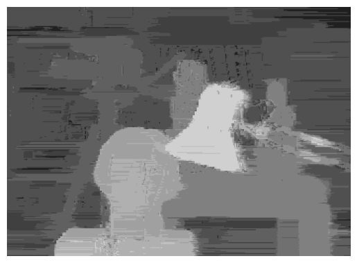
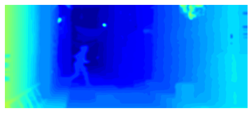

# [Quantum-Hybrid Stereo Matching with Nonlinear Regularization and Spatial Pyramids](TODO: Link to paper once published)
[Cameron Braunstein](https://cvmp.cs.uni-saarland.de/people/#cameron-braunstein), [Vladislav Golyanik](https://people.mpi-inf.mpg.de/~golyanik/) [Eddy Ilg](https://cvmp.cs.uni-saarland.de/people/#eddy-ilg)


## Initial Set Up

This code is written in Python. We recommend [conda](https://docs.conda.io/en/latest/) for ease of set up, however this is not strictly necessary.

Once in our Python environment of choice, run

```
$ pip install -r requirements.txt
```
to install all necessary Python libraries


## DWave

In order to have access to DWave's remote services, you must have an account with DWave, as well as some additional configuration set up on your local machine. Follow the instructions presented [here](https://docs.ocean.dwavesys.com/en/stable/overview/install.html#set-up-your-environment).

## Gurobi

There are additional steps needed to set up Gurobi for optimizations. [here](https://docs.ocean.dwavesys.com/en/stable/overview/install.html#set-up-your-environment)


## iViz 

Optionally, one can also install [iViz](https://github.com/eddy-ilg/iviz) to view relevant data quickly. Alternatively, however, one can view the outputs via standard image viewing applications without any trouble.

## Data

The Middlebury data which we work with in our paper is all available here: https://vision.middlebury.edu/stereo/data/scenes2001/ . Due to the small size of this data, we have included it in the repository.


If you wish to work with the Sintel stereo data, download the .zip from [here](http://sintel.is.tue.mpg.de/stereo), and place it into the /datasets directory. Next, unzip the file. In Linux, this can be done using the unzip command, for example
```
$ unzip datasets/MPI-Sintel-stereo-training-20150305.zip
```


## To Run:

To see the gurobi optimizer run on the Tsukuba pair from the Middlebury dataset, run 
```
$ ./example_tsukuba.sh
```
The output (before filtering) should look like this:




For the first frame of the Market 2 scene of Sintel, run
$ ./example_sintel.sh
```

One can see the result of running this estimation process across an entire Sintel scene below:




Outputs from all resolution levels will be saved in the /output_data directory.

## Citation

Please cite our work if you use the code.

```
TODO: Put in Bibtex Citation
```

## License

This work is licensed under the Creative Commons Attribution-NonCommercial-ShareAlike 4.0 International License. To view a copy of this license, visit [http://creativecommons.org/licenses/by-nc-sa/4.0/](http://creativecommons.org/licenses/by-nc-sa/4.0/) or send a letter to Creative Commons, PO Box 1866, Mountain View, CA 94042, USA.